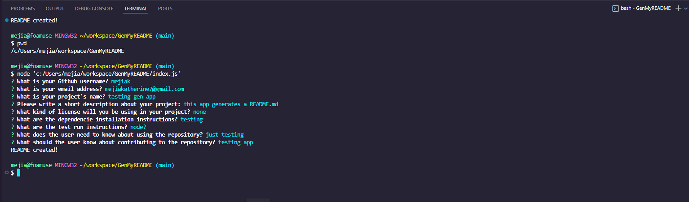
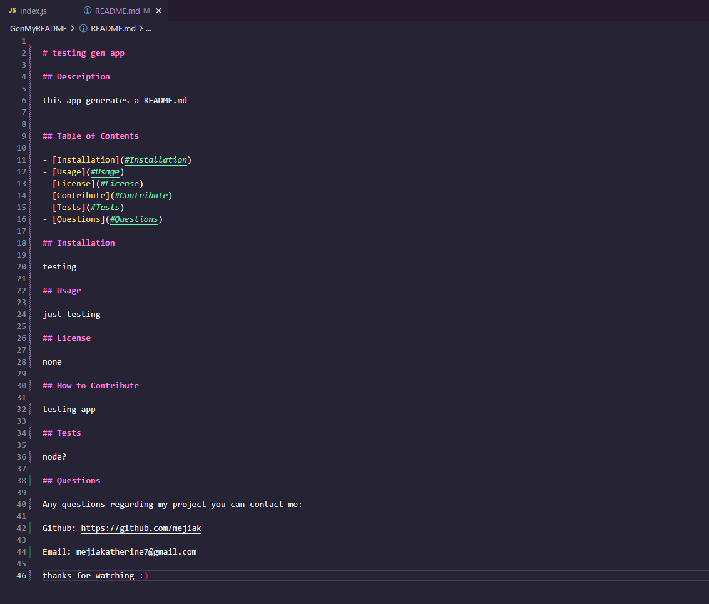

# GenMyREADME

# Description
For Challenge- 9 I was asked to create a command-line application that can generate a proffesional README.md file from a user's input.

With this command-line application you can quickly and easily create a high quality README for your project.

# Layout
When you first run this application it prompts the enduser with multiple questions about their project

After the enduser inputs their desired information the application then create a well structured, high quality, professional README.md which includes:

Title of Project
Description
Table of Contents
Installation
Usage
License
How to Contribute
Tests
Questions

# Screenshots
Running the Command-Line Application

# Repository Links
https://github.com/mejiak7/GenMyREADME.git